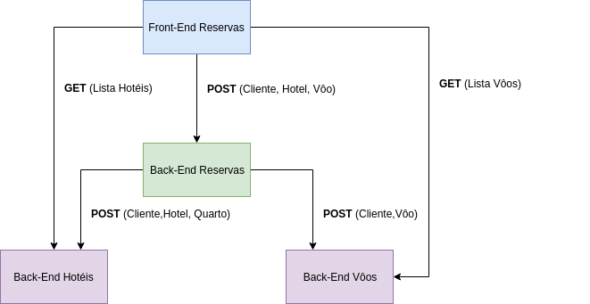

# [TP] Hotel REST

Parte do projeto Travel Package (TP), inclui o back-end para registro dos hotéis, quartos e hóspedes.


**Travel Package (TP):** constitui de um projeto de teste de familiarização com a tecnologia [Spring](https://spring.io/) e [React](https://reactjs.org/). Onde o usuário poderá fazer uma reserva de um pacote de viagem (Vôo + Quarto de Hotel) através de uma página em React, consumindo e alimentando as API's REST de Reserva (armazena o pacote), Vôos (armazena os vôos) e Hotéis (armazena os hotéis) utilizando um banco de dados [MySQL](https://www.mysql.com/). Também é fornecida uma Dashboard  que exibe estatísticas.




## Getting Started

A seguir serão listadas as informações necessárias para a execução do projeto.

### Prerequisites

Pré-requisitos necessários para a execução do projeto:

- Gradle 4.10.2;
- Java 8;
- Deploy do banco de dados contido [neste](https://github.com/Davidsksilva/Travel-Booking-App) repositório.

### Executing

Na primeira execução, é necessário pré carregar dados no banco de dados. Para isso no pacote **com.projects.hotelrest** e class **LoadDatabase** descomentar a linha *@Bean* em:

```Java
 //@Bean
    CommandLineRunner initDatabase(PassengerRepository p_repo, FlightCompanyRepository fc_repo, FlightRepository f_repo)
```

E em **application.properties** alterar o modo hibernate para **create** , também apenas para a primeira execução:

```properties
spring.jpa.hibernate.ddl-auto=create
```

É importante reverter os passos anteriores para as próximas execuções do programa, evitando a duplicação de dados.

Para a execução do back-end:

```bash
git clone https://github.com/Davidsksilva/Travel-Booking-App.git
cd /Hotel-Rest/
./gradlew bootRun
```
